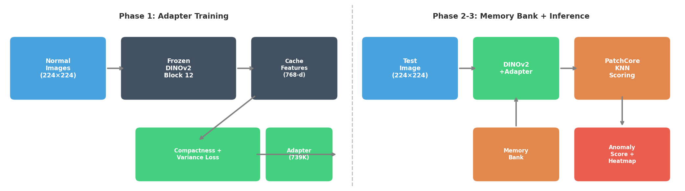
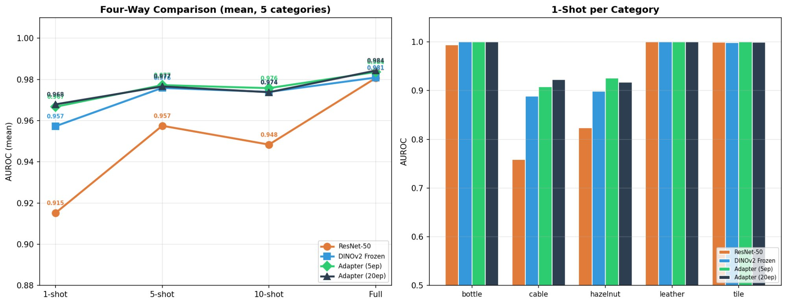
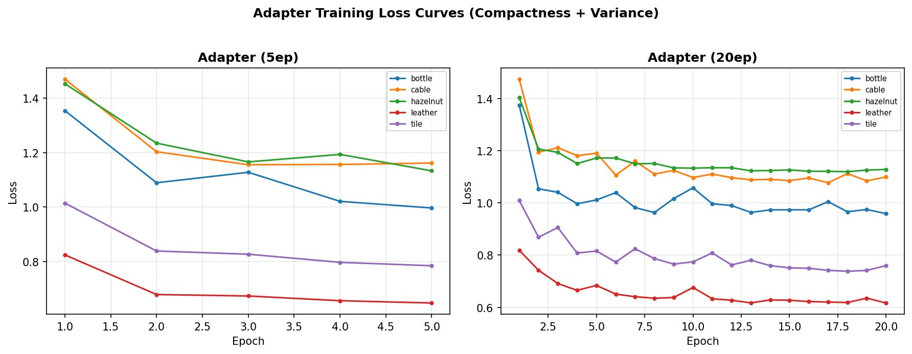

# Comparative Analysis of Vision Foundation Models for Few-Shot Industrial Anomaly Detection

This project investigates the use of DINOv2 self-supervised Vision Transformer features for few-shot industrial anomaly detection using the PatchCore framework. A layer-wise ablation identifies Block 12 as optimal, and a lightweight LinearAdapter (~739K parameters) is trained to adapt frozen DINOv2 features to the industrial domain, achieving +1.1 pp AUROC improvement over frozen features and +5.3 pp over ResNet-50 at 1-shot.

**Author:** Phumapiwat Chanyuthagorn  
**College:** Rochester Institute of Technology, MS in Artificial Intelligence  
**Email:** pc4807@rit.edu  
**Course:** IDAI-780, Spring 2026

---

## Framework



The pipeline consists of three phases:
1. **Feature Caching:** Frozen DINOv2 ViT-B/14 Block 12 extracts 768-dim patch features from normal training images
2. **Adapter Training:** A lightweight MLP (768→384→384→768 with residual connection, ~739K params) is trained on cached features with compactness + variance preservation loss
3. **PatchCore Scoring:** Adapted features are stored in a memory bank; test images are scored by nearest-neighbor patch distance

---

## Project Structure

```
├── data/                  # Dataset instructions (MVTec AD)
│   └── README.md
├── scripts/               # Utility scripts
│   └── download_mvtec.sh
├── models/                # Saved adapter checkpoints (generated after training)
├── notebooks/             # Colab notebooks for each experiment
│   ├── Ckpt2_Baseline_ResNet50.ipynb
│   ├── Ckpt3_DINOv2_Ablation.ipynb
│   └── Ckpt3_Adapter.ipynb
├── results/               # CSV results and training logs
│   └── adapter_results.csv
├── figures/               # Plots and diagrams
│   ├── framework.png
│   ├── adapter_comparison.png
│   └── adapter_losses.png
├── requirements.txt
└── README.md
```

---

## Installation

### Clone the repository

```bash
git clone https://github.com/YOUR_USERNAME/vfm-fewshot-anomaly-detection.git
cd vfm-fewshot-anomaly-detection
```

### Install dependencies

```bash
pip install -r requirements.txt
```

### Environment

- Python 3.10+
- PyTorch 2.0+ with CUDA
- Google Colab with T4 GPU (recommended)

---

## Data Preparation

This project uses the [MVTec Anomaly Detection (MVTec AD)](https://www.mvtec.com/company/research/datasets/mvtec-ad) dataset.

### Download

1. Download category zip files from the MVTec AD website
2. Place them in the Colab working directory:

```bash
# In Google Colab
!mkdir -p /content/datasets/
# Upload bottle.zip, cable.zip, hazelnut.zip, leather.zip, tile.zip
!unzip -qo /content/bottle.zip -d /content/datasets/
!unzip -qo /content/cable.zip -d /content/datasets/
!unzip -qo /content/hazelnut.zip -d /content/datasets/
!unzip -qo /content/leather.zip -d /content/datasets/
!unzip -qo /content/tile.zip -d /content/datasets/
```

### Dataset structure

Each category follows the MVTec AD standard structure:

```
bottle/
├── train/good/        # 209 defect-free images (training)
├── test/
│   ├── good/          # 20 normal test images
│   ├── broken_large/  # anomalous test images
│   ├── broken_small/
│   └── contamination/
└── ground_truth/      # pixel-level defect masks
```

Five categories are used: **bottle** (object), **cable** (object), **hazelnut** (object), **leather** (texture), **tile** (texture).

---

## Usage

### Training the Adapter

Open `notebooks/Ckpt3_Adapter.ipynb` in Google Colab and run all cells. The notebook:

1. Loads frozen DINOv2 ViT-B/14 and extracts Block 12 patch features
2. Caches all patch features from normal training images
3. Trains the LinearAdapter MLP on cached features

**Key hyperparameters:**

| Parameter | Value |
|-----------|-------|
| Adapter architecture | 768 → 384 → 384 → 768 + residual |
| Trainable parameters | 738,817 |
| Optimizer | AdamW (lr=1e-3, wd=1e-4) |
| Scheduler | Cosine annealing |
| Batch size | 4,096 patches |
| Epochs | 5 and 20 |
| Loss | Compactness + variance preservation (λ=10, τ=0.5) |

### Testing / Evaluation

After adapter training, evaluation runs automatically in the same notebook:

1. For each shot count (1, 5, 10, Full) and each category:
   - Builds PatchCore memory bank from adapted features
   - Scores all test images via nearest-neighbor distance
   - Computes image-level AUROC

### Running the Baseline

Open `notebooks/Ckpt2_Baseline_ResNet50.ipynb` for the ResNet-50 PatchCore baseline.

### Running the Ablation Study

Open `notebooks/Ckpt3_DINOv2_Ablation.ipynb` for the DINOv2 block-wise ablation (blocks 3, 6, 9, 12).

---

## Results

### Main Comparison (Cross-category Average AUROC)

| Model | 1-shot | 5-shot | 10-shot | Full |
|-------|--------|--------|---------|------|
| ResNet-50 (frozen) | 0.915 | 0.958 | 0.948 | 0.981 |
| DINOv2 Frozen B12 | 0.957 | 0.976 | 0.974 | 0.981 |
| Contrastive FT | 0.953 | 0.968 | 0.967 | 0.983 |
| Distillation FT | 0.957 | 0.976 | 0.974 | 0.981 |
| **Adapter (20ep)** | **0.968** | **0.977** | **0.974** | **0.984** |

### Layer-Wise Ablation (Frozen DINOv2)

| Block | 1-shot | 5-shot | 10-shot | Full |
|-------|--------|--------|---------|------|
| Block 3 | 0.860 | 0.880 | 0.899 | 0.918 |
| Block 6 | 0.882 | 0.912 | 0.905 | 0.977 |
| Block 9 | 0.470 | 0.574 | 0.576 | 0.750 |
| Block 12 | **0.957** | **0.976** | **0.974** | **0.981** |

### Comparison Figure



### Training Loss Curves



---

## Key Findings

1. **DINOv2 Block 12 is optimal** for PatchCore anomaly detection across all shot counts and categories
2. **Block 9 is a dead zone** (0.470 at 1-shot) — the spatial-to-semantic feature transition produces representations unsuitable for patch-level scoring
3. **Direct backbone fine-tuning fails** — 21.3M parameters on ~209 images causes over-adaptation
4. **Lightweight adapter succeeds** — 739K parameters trained on ~53K cached patches improves 1-shot AUROC by +1.1 pp over frozen DINOv2

---

## References

- Roth, K., et al. "Towards Total Recall in Industrial Anomaly Detection." CVPR 2022.
- Oquab, M., et al. "DINOv2: Learning Robust Visual Features without Supervision." arXiv:2304.07193, 2023.
- Damm, et al. "AnomalyDINO: Boosting Patch-based Few-shot Anomaly Detection with DINOv2." arXiv:2405.14529, 2024.
- Bergmann, et al. "MVTec AD — A Comprehensive Real-World Dataset for Unsupervised Anomaly Detection." CVPR 2019.

## Acknowledgment

This project builds upon the PatchCore framework by Roth et al. (2022) and uses the DINOv2 pretrained model by Meta AI (Oquab et al., 2023). The MVTec AD dataset is provided by MVTec Software GmbH. The AnomalyDINO paper (Damm et al., 2024) served as primary reference for combining DINOv2 with PatchCore.

## License

This project is licensed under the MIT License.
